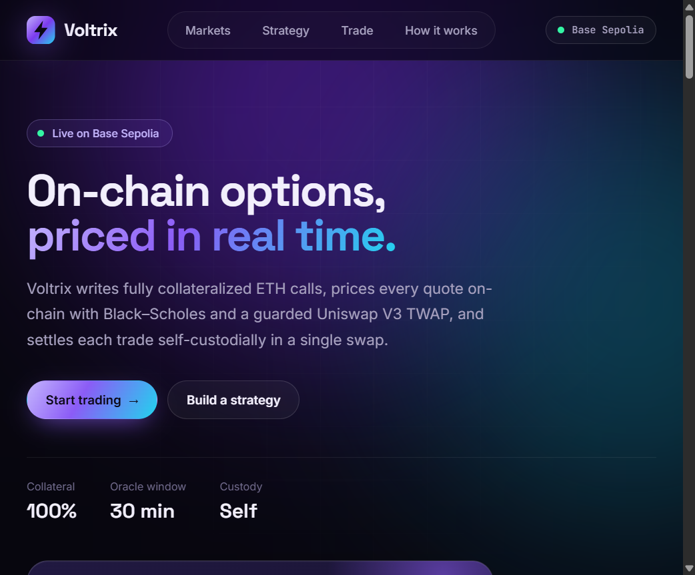
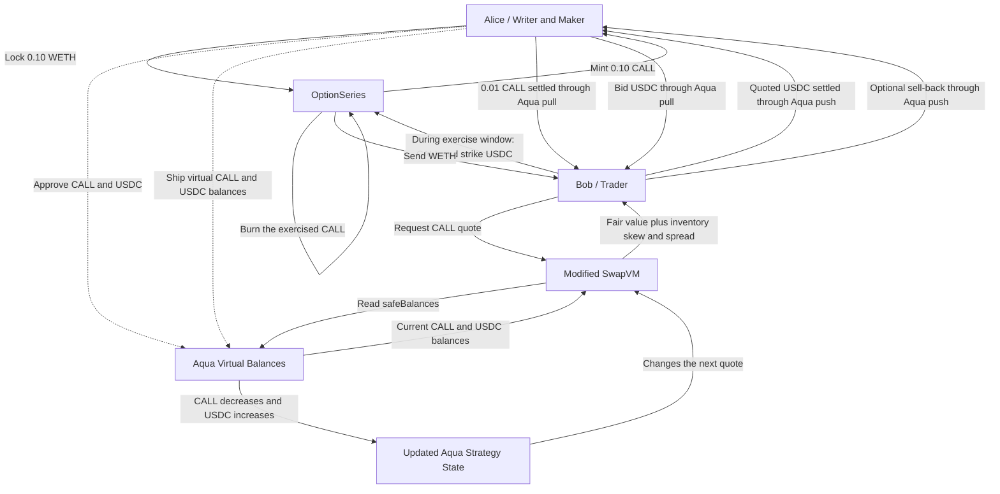

<div align="center">

# ⚡ Voltrix

**On-chain options, priced in real time.**

Fully collateralized ETH call options, priced on-chain with Black–Scholes and a
guarded Uniswap V3 TWAP, and settled self-custodially in a single swap.

Built for **Hackerhouse** · Live on **Base Sepolia**

</div>



---

## Table of contents

- [Overview](#overview)
- [Features](#features)
- [How it works](#how-it-works)
- [Live Base Sepolia deployment](#live-base-sepolia-deployment)
- [Quick start](#quick-start)
- [Project structure](#project-structure)
- [Tech stack](#tech-stack)
- [Pricing model](#pricing-model)
- [Uniswap integration](#uniswap-integration)
- [Testing](#testing)
- [Documentation](#documentation)
- [Trust model and limitations](#trust-model-and-limitations)
- [Protocol attribution](#protocol-attribution)

## Overview

Voltrix is a programmable options market. A liquidity maker locks WETH to mint
fully collateralized European call options, then makes them available for
trading without handing custody to a pool. Every quote is computed on-chain from
live inputs:

1. **Spot price** from a 30-minute Uniswap V3 TWAP, checked for freshness,
   liquidity, and manipulation on every read.
2. **Fair value** from a fixed-point Black–Scholes model using on-chain implied
   volatility.
3. **Executable ask** from a custom SwapVM instruction that adds inventory skew
   and spread, so each sale raises the next quote.
4. **Settlement** through Aqua, which moves tokens directly between maker and
   buyer.

The whole flow is live on Base Sepolia, backed by a public trade with reconciled
balances. No backend is required.

> **Naming note:** Voltrix began under the working name *AquaVol*. The deployed
> Solidity contracts, the Python package, and the specification documents keep
> that original name because on-chain contracts cannot be renamed.

## Features

- **Live options market:** a deployed WETH $4,000 CALL expiring 04 Oct 2026, with
  supply, collateral, and volatility read directly from the chain.
- **Strategy lab:** build up to four CALL/PUT legs, use presets (live call, bull
  call spread, long straddle), and read quotes from a strike ladder.
- **Interactive payoff chart:** expiry profit and loss with breakevens, window
  max/min, and a hover crosshair.
- **Wallet trading:** connect MetaMask as a *Liquidity Maker* (write and supply
  CALLs) or an *Option Buyer* (buy at the on-chain ask), with a step-by-step
  transaction flow and progress tracking.
- **Clear live vs. simulated labels:** only the deployed instrument is marked
  `LIVE`; every other strike, expiry, and PUT is marked `SIM`.
- **On-chain proof:** links to every contract and to the public settlement
  transaction.

## How it works



| Component | Role |
| --- | --- |
| `OptionSeries` | Holds WETH collateral 1:1 with CALL supply and enforces the active, exercise, and redemption phases. |
| Uniswap V3 TWAP oracle | Supplies a guarded 30-minute spot price. |
| Volatility registry | Stores bounded, time-stamped implied volatility. |
| Pricing engine | Runs the Black–Scholes fair-value and inventory-skew instructions. |
| Modified SwapVM router | Executes the trade program and enforces the buyer's maximum price. |
| Aqua | Tracks the maker's virtual balances and settles token transfers without custodying inventory. |

### Option lifecycle

1. **Active** (before expiry): the writer locks WETH and mints CALL tokens.
2. **Exercise window** (after expiry): holders pay the $4,000 strike per CALL
   in the quote token and receive WETH.
3. **Redeemable** (after the window closes): the writer reclaims remaining WETH
   and collected strike payments.

## Live Base Sepolia deployment

All assets and liquidity are test infrastructure on Base Sepolia (`84532`).

| Component | Address |
| --- | --- |
| Demo USD (`avUSD`) | [`0xf475...A9dc`](https://sepolia.basescan.org/address/0xf47584005b5c0F90f292C811016E70e37E3BA9dc) |
| WETH/avUSD Uniswap V3 pool | [`0x0d95...6D0`](https://sepolia.basescan.org/address/0x0d9516aA182Aa72284802372afaa943E9E77A6D0) |
| Exact-source Aqua | [`0x170B...4F9`](https://sepolia.basescan.org/address/0x170B0d7C534785eAD9Ecbc278B3D87781855D4F9) |
| Pricing engine | [`0x68b7...4884`](https://sepolia.basescan.org/address/0x68b7036ae9e1266675f226F36d2c764927C84884) |
| Modified SwapVM router | [`0x8b73...ceb4`](https://sepolia.basescan.org/address/0x8b734D9222D51Aa75C038AB81145FC86D5b4ceb4) |
| Volatility registry | [`0xF253...C37e`](https://sepolia.basescan.org/address/0xF2537463ddeA54EEa205bD183a9e303bDe02C37e) |
| Guarded TWAP oracle | [`0x2D2b...8903`](https://sepolia.basescan.org/address/0x2D2bfade5AD73C946fdcA2a882A21E542A568903) |
| WETH 4,000 CALL series | [`0x7F3c...A117`](https://sepolia.basescan.org/address/0x7F3c414aEf81CAf377fF34A419EC388105fBA117) |

**Public trade proof:** a distinct trader's
[`0.01 CALL` purchase](https://sepolia.basescan.org/tx/0xb49b7574aa15a92cb96fb6b804279ca321488dcd1b43a8c6bb780a9dd1cf7379)
paid **0.779818 avUSD**. Maker inventory fell from 0.10 to 0.09 CALL, and the
unchanged strategy then quoted **0.815649 avUSD** for the next 0.01 CALL.
`OptionSeries` retained the full 0.10 WETH collateral throughout.

See the [deployment record](docs/BASE_SEPOLIA_DEPLOYMENT.md) for constructor
settings, the transaction sequence, balance reconciliation, and verification
commands.

## Quick start

**Prerequisites:** Node.js 18+ and Git. MetaMask with Base Sepolia ETH is only
needed for wallet transactions.

```bash
git clone --recurse-submodules https://github.com/ABIN2005/Voltrix.git
cd Voltrix/frontend
npm install
npm run dev
```

Open <http://localhost:5173>. The app reads live data from Base Sepolia
immediately; no private key or backend is needed.

Optional: copy `frontend/.env.example` to `frontend/.env` to override the public
RPC endpoint.

**Production build:**

```bash
npm run build     # outputs to frontend/dist
npm run preview
```

For static hosting (Vercel, Netlify, Cloudflare Pages), use `frontend` as the
root directory, `npm run build` as the build command, and `dist` as the output
directory.

## Project structure

```text
Voltrix/
├── frontend/           React + TypeScript + Vite web app
│   └── src/
│       ├── components/ Hero, strategy lab, payoff chart, trade panel, proof
│       ├── data/       Deployed addresses and market constants
│       └── domain/     Browser-side Black–Scholes and payoff math
├── contracts/          Solidity smart contracts (Foundry)
│   ├── src/            OptionSeries, oracles, pricing, SwapVM instructions
│   ├── script/         Base Sepolia deployment scripts
│   ├── test/           Unit, integration, invariant, and fork tests
│   └── lib/            Aqua, SwapVM, and PRBMath (git submodules)
├── python/             Independent Black–Scholes reference model
├── test/vectors/       Deterministic test vectors shared across languages
├── specs/              Product and protocol specifications
├── docs/               Deployment evidence, provenance, engineering log
└── prompts/            Recorded AI prompts used during development
```

## Tech stack

| Layer | Technology |
| --- | --- |
| Frontend | React 18, TypeScript, Vite, viem |
| Smart contracts | Solidity 0.8.30, Foundry |
| Protocols | 1inch Aqua, 1inch SwapVM, Uniswap V3 |
| Math | PRBMath fixed-point, Python reference model |
| Network | Base Sepolia |

## Pricing model

The executable ask combines three steps:

```text
fair value     = Black–Scholes(spot, strike, time to expiry, volatility)
reservation    = fair value × (1 + γ × average fraction of inventory sold)
executable ask = reservation × (1 + half-spread)
```

The live strategy uses an initial inventory of 0.10 CALL, γ = 0.2, and a 1%
half-spread. Because the skew grows as inventory is sold, each purchase raises
the next quote automatically.

For the canonical reference inputs (3,800 spot, 4,000 strike, seven days, 64%
volatility), the fair call value is `60.294026671319` USDC and the initial
one-CALL ask is `61.505936607413` USDC before token-unit rounding. See the
[Python reference](python/README.md) and
[test vectors](test/vectors/black_scholes-v1.json).

## Uniswap integration

Voltrix creates a WETH/avUSD pool through the official Base Sepolia Uniswap V3
position manager and uses it as the guarded spot input to option pricing. On
every read the adapter verifies factory identity, token order, fee tier, a
complete 30-minute observation window, latest-observation freshness, current
and harmonic liquidity, spot/TWAP deviation, and price bounds.

- [`UniswapV3TwapOracle.sol`](contracts/src/oracles/uniswap/UniswapV3TwapOracle.sol): guarded on-chain TWAP reads
- [`UniswapV3OracleMath.sol`](contracts/src/oracles/uniswap/UniswapV3OracleMath.sol): cumulative-tick and normalized quote math
- [`BootstrapUniswapV3Pool.s.sol`](contracts/script/BootstrapUniswapV3Pool.s.sol): official factory and position-manager usage
- [`WriteTwapObservation.s.sol`](contracts/script/WriteTwapObservation.s.sol): full-window check and observation write
- [`BaseSepoliaDeploymentRehearsal.t.sol`](contracts/test/fork/BaseSepoliaDeploymentRehearsal.t.sol): end-to-end fork proof
- [`FEEDBACK.md`](FEEDBACK.md): Uniswap developer feedback

The pool uses the project-issued `avUSD` demo token and is not a canonical USDC
market or a production oracle.

## Testing

**Smart contracts** (requires [Foundry](https://book.getfoundry.sh/)):

```bash
cd contracts
forge fmt --check
forge build
forge test
```

**Python reference model:**

```bash
PYTHONPATH=python python3 -m unittest discover -s python/tests -v
```

**Frontend type-check and build:**

```bash
cd frontend
npm run build
```

## Documentation

**Specifications**

- [Foundation](specs/00-foundation.md) · [Product](specs/01-product.md) · [Option lifecycle](specs/02-option-lifecycle.md)
- [Pricing model](specs/03-pricing-model.md) · [Aqua and SwapVM integration](specs/04-aqua-swapvm-integration.md)
- [Security invariants](specs/05-security-invariants.md) · [Demo acceptance](specs/06-demo-acceptance.md)
- [Custom SwapVM router](specs/07-custom-swapvm-router.md) · [Uniswap V3 TWAP oracle](specs/08-uniswap-v3-twap-oracle.md)
- [Volatility and fair value](specs/09-volatility-and-fair-value.md) · [Inventory-aware pricing](specs/10-inventory-aware-pricing.md)
- [Base Sepolia deployment](specs/11-base-sepolia-deployment.md) · [Frontend workspace](specs/12-frontend-strategy-workspace.md) · [Live wallet settlement](specs/13-live-wallet-settlement.md)

**Evidence and provenance**

- [Base Sepolia deployment record](docs/BASE_SEPOLIA_DEPLOYMENT.md) · [Deployment plan](docs/BASE_SEPOLIA_DEPLOYMENT_PLAN.md) · [Fork rehearsal](docs/BASE_SEPOLIA_REHEARSAL.md)
- [Baseline swap evidence](docs/BASELINE_SWAP_EVIDENCE.md) · [Custom router settlement evidence](docs/CUSTOM_ROUTER_SETTLEMENT_EVIDENCE.md) · [Uniswap evidence](docs/BASE_SEPOLIA_UNISWAP_EVIDENCE.md)
- [Engineering log](docs/ENGINEERING_LOG.md) · [Dependency register](docs/DEPENDENCY_REGISTER.md) · [AI usage](docs/AI_USAGE.md)
- [Protocol provenance](docs/PROTOCOL_PROVENANCE.md) · [Uniswap provenance](docs/UNISWAP_PROVENANCE.md) · [PRBMath provenance](docs/PRB_MATH_PROVENANCE.md)
- [Contract notes](contracts/README.md) · [Repository policy](docs/REPOSITORY_POLICY.md)

## Trust model and limitations

- **Testnet only.** Voltrix runs on Base Sepolia with demo assets. It is
  unaudited and not production software.
- **Consolidated operator.** One dedicated testnet wallet acts as deployer,
  volatility updater, option writer, and Aqua maker. This role can influence
  quotes and is a disclosed simplification, not a production security model.
- **Independent counterparty.** A separate browser-connected trader wallet
  provides the public settlement evidence.
- **One live instrument.** Only the WETH $4,000 CALL expiring 04 Oct 2026 is
  deployed; all other quotes in the app are simulations.
- **No secrets in the repo.** Neither wallet should hold mainnet assets, and no
  private key belongs in this repository.

## Protocol attribution

Powered by Aqua — © Degensoft Ltd 2025.

Powered by SwapVM — © Degensoft Ltd 2025.

The pinned Aqua and SwapVM sources retain their upstream licenses and notices.
Any component that modifies or extends SwapVM is published under
`LicenseRef-Degensoft-SwapVM-1.1`; independent components keep their own stated
licenses. See [protocol provenance](docs/PROTOCOL_PROVENANCE.md).

**References:** [Aqua contracts](https://github.com/1inch/aqua) ·
[SwapVM contracts](https://github.com/1inch/swap-vm) ·
[Aqua TypeScript SDK](https://github.com/1inch/sdks/tree/master/typescript/aqua) ·
[Uniswap V3](https://docs.uniswap.org/contracts/v3/overview)
